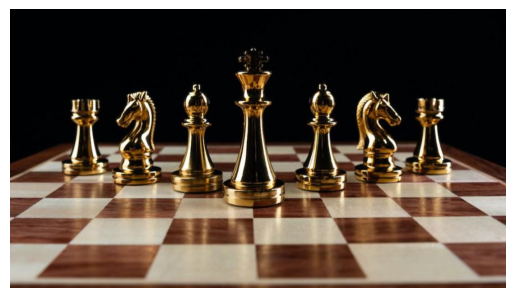

# YOLOv7 on Custom Dataset

This repository contains an implementation of YOLOv7 on a custom dataset. YOLOv7 is an evolution of the YOLO (You Only Look Once) family of real-time object detection models. This implementation allows training and inference on custom datasets for various object detection tasks.

## Features

- **State-of-the-Art Object Detection**: YOLOv7 leverages advancements in model architecture and training techniques to achieve state-of-the-art performance in object detection tasks.
- **Custom Dataset Support**: This implementation provides support for training YOLOv7 on custom datasets, allowing users to tackle specific object detection challenges.
- **Easy-to-Use**: With clear instructions and code examples, users can quickly set up and train YOLOv7 on their own datasets.
- **Flexibility**: YOLOv7 supports various model configurations and hyperparameters, enabling users to adapt the model to different tasks and hardware constraints.

## Getting Started

To get started with YOLOv7 on your custom dataset, follow these steps:

**Clone yolov7 repository**:
```
git clone https://github.com/WongKinYiu/yolov7
cd yolov7
```
```
pip install -r requirements.txt
```

**Prepare your dataset**:
- Chess pieces dataset from roboflow is used for this project, can be downloaded from https://universe.roboflow.com/new-workspace-yv6yw/ssd-vhs3t/dataset/1
<div align="center">
    <a href="./">
        
    </a>
</div>

- Organize your dataset into the required structure compatible with YOLOv7. This typically involves arranging images and their corresponding annotations (in YOLO format) into appropriate directories.

**Modify configuration files**:
- Adjust the configuration files (`yolov7/custom.yaml`) to match your dataset specifications, including the number of classes and input image size.

**Train the model**:
```
python train.py --img 640 --batch 16 --epochs 50 --data custom.yaml --cfg models/yolov7-tiny.yaml --weights
```
adjust the parameters according to your data

**Evaluate the model**:
```
python val.py --data custom.yaml --weights runs/train/exp/weights/best.pt
```
adjust the parameters according to your data

**Make predictions**:
```
python detect.py --source test.jpg --weights runs/train/exp/weights/best.pt --img-size 640 --conf 0.4
```
adjust the parameters according to your data

For detailed usage instructions and additional options, refer to the documentation.

## Acknowledgements

- YOLOv7 is developed by WongKinYiu. Visit the [official repository](https://github.com/WongKinYiu/yolov7) for more information.
- This implementation is based on the original YOLOv7 codebase.
